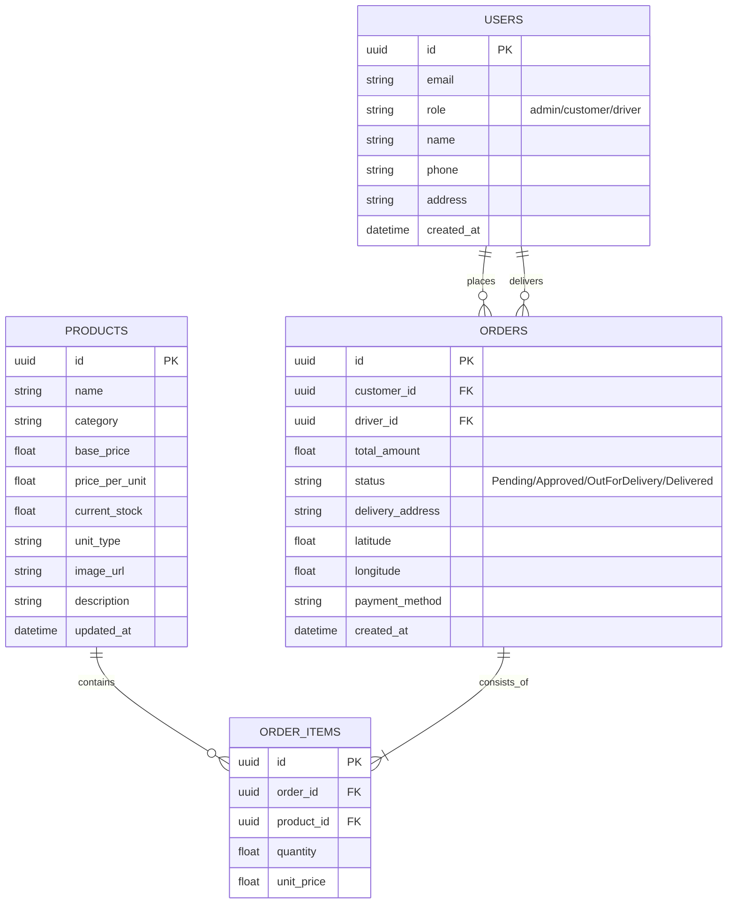
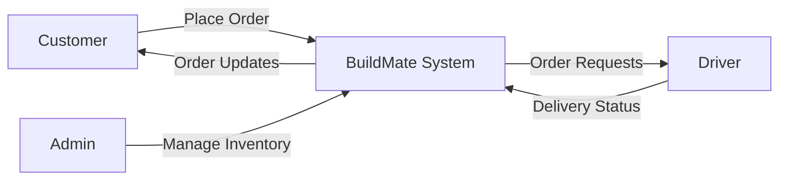

# BUILDMATE: CONSTRUCTION MATERIAL MANAGEMENT SYSTEM
## Final Project Documentation

---

### ABSTRACT
BuildMate is a comprehensive mobile solution developed to transform the traditional, manual processes of construction material procurement and delivery into a streamlined digital ecosystem. The project leverages **React Native (Expo)** for the frontend and **Supabase** (PostgreSQL/Auth/Storage) for the backend, offering a robust real-time platform for three distinct user roles: Administrators, Customers, and Drivers. 

The system addresses critical industry pain points such as inventory inaccuracies, lack of delivery transparency, and inefficient logistical coordination. By implementing a centralized database with real-time synchronization, BuildMate ensures that stock levels are always accurate, orders are tracked from placement to delivery, and financial transactions are recorded securely. This documentation details the complete lifecycle of the project development, from system analysis and design to implementation and testing strategies.

---

### TABLE OF CONTENTS
1.  **Chapter I: Introduction**
    *   1.1 Problem Definition
    *   1.2 Project Objectives
    *   1.3 Scope of the Project
2.  **Chapter II: System Analysis**
    *   2.1 Existing System
    *   2.2 Proposed System
3.  **Chapter III: Development Environment**
    *   3.1 Hardware Requirements
    *   3.2 Software Requirements
    *   3.3 Software Description
4.  **Chapter IV: System Design**
    *   4.1 Data Model
        *   4.1.1 Entity Relationship Diagram
        *   4.1.2 Data Dictionary
        *   4.1.3 Table Relationship
    *   4.2 Process Model
        *   4.2.1 Context Analysis Diagram
        *   4.2.2 Data Flow Diagram
5.  **Chapter V: Software Development**
    *   5.1 Modular Description
    *   5.2 Key Logic Implementation
6.  **Chapter VI: Testing**
    *   6.1 System Testing
    *   6.2 Test Data and Output
        *   6.2.1 Unit Testing
        *   6.2.2 Integration Testing
    *   6.3 Testing Techniques and Strategies
    *   6.4 Validation Testing
    *   6.5 User Acceptance Testing
7.  **Chapter VII: System Implementation**
    *   7.1 Introduction
    *   7.2 Implementation
8.  **Chapter VIII: Performance and Limitations**
    *   8.1 Merits of the system
    *   8.2 Limitations of the system
    *   8.3 Future Enhancements
9.  **Chapter IX: Appendices**
    *   9.1 Sample Screens and Reports
    *   9.2 User Manual
    *   9.3 Conclusion
10. **Chapter X: References**

---

### CHAPTER I: INTRODUCTION

BuildMate is designed to solve these issues by providing a **unified digital marketplace** where inventory is managed in real-time, order tracking is automated, and delivery logistics are handled through a dedicated driver interface.

#### 1.2 Project Objectives
The primary objectives of the BuildMate system are:
*   **Centralization**: To create a single source of truth for construction material data, accessible to all stakeholders.
*   **Transparency**: To provide customers with real-time tracking of their orders and transparent pricing.
*   **Efficiency**: To reduce the time between order placement and delivery assignment through automation.
*   **Scalability**: To build a modular system that can easily expand into new material categories and geographic regions.
*   **Data Integrity**: To ensure that stock levels are never manually "guessed" but are updated via atomic database transactions.

#### 1.3 Scope of the Project
The scope of this project encompasses the development of a cross-platform mobile application and a cloud-based backend. Key boundaries include:
*   **User Management**: Full registration and authentication for three distinct roles.
*   **Inventory Control**: CRUD (Create, Read, Update, Delete) operations for materials, including image management.
*   **Logistics Engine**: Mapping and routing services for delivery drivers.
*   **Financial Tracking**: Generation of digital receipts and maintenance of order history.
*   **Real-time Infrastructure**: Implementation of persistent connections for instant data syncing.

---

### CHAPTER II: SYSTEM ANALYSIS

#### 2.1 Existing System
The traditional system of construction material management typically involves:
*   **Manual Booking**: Orders are placed via phone calls or in-person visits.
*   **Paper-Based Invoicing**: Receipts and delivery notes are handwritten or printed manually, making archival and retrieval difficult.
*   **Fragmented Tracking**: Customers must call the supplier to check on delivery status, who in turn must call the driver.
*   **Static Inventory**: Stock levels are updated at the end of the day or week, leading to "overselling" situations during peak hours.

#### 2.2 Proposed System
The proposed BuildMate system introduces a modernized, automated approach:
*   **Real-time Availability**: The mobile app fetches live stock data directly from the Supabase PostgreSQL database.
*   **Role-Based Access Control (RBAC)**: Specific dashboards for Admins (inventory/orders), Customers (shopping), and Drivers (delivery tasks).
*   **Automated Workflow**: When a customer places an order, stock is automatically adjusted, and an entry is created for the Admin to approve and assign a driver.
*   **Location Intelligence**: Uses `expo-location` and `react-native-maps` to capture precise delivery coordinates and provide navigation routes for drivers.
*   **Cloud Synchronization**: All data is synced across devices instantly using Supabase Real-time updates.

---

### CHAPTER III: DEVELOPMENT ENVIRONMENT

#### 3.1 Hardware Requirements
For the development and deployment of BuildMate, the following hardware specifications were utilized:

**A. Development Machine (Workstation):**
*   **Processor**: Intel Core i5/i7 (10th Gen or higher) or Apple M1/M2 chip.
*   **RAM**: 16 GB DDR4 (minimum 8 GB required for smooth Android Studio/Xcode emulation).
*   **Storage**: 256 GB SSD (512 GB recommended for large dependency caches).
*   **Display**: Full HD (1920x1080) for interface design and debugging.

**B. Target Mobile Devices:**
*   **Android**: Devices running Android 8.0 (Oreo) or higher with GPS capabilities.
*   **iOS**: iPhone models running iOS 13.0 or higher.
*   **Storage**: Minimum 100 MB available space for the application.

#### 3.2 Software Requirements
The project relies on a modern software stack to ensure cross-platform compatibility and rapid development:

*   **Operating System**: Windows 11 / macOS Sonoma / Linux (Ubuntu).
*   **Development Environment (IDE)**: Visual Studio Code (with React Native & TypeScript extensions).
*   **Version Control**: Git / GitHub.
*   **Frameworks**: React Native, Expo SDK (v51+).
*   **Backend as a Service (BaaS)**: Supabase.
*   **Package Manager**: npm or yarn.
*   **State Management**: Zustand.
*   **Navigation**: Expo Router (File-based routing).

#### 3.3 Software Description
BuildMate is built upon a modern, cloud-native stack that ensures high performance and developer productivity:

*   **React Native & Expo SDK**: 
    *   React Native is the foundational framework that allows for the creation of truly native mobile applications using JavaScript and React. Unlike hybrid frameworks, React Native renders using real native UI components, ensuring a smooth 60fps experience.
    *   Expo is a comprehensive platform and ecosystem that simplifies the React Native development lifecycle. It provides essential services like **EAS Build** for cloud-based binaries, **Expo Go** for sandboxed testing, and a unified API for accessing device hardware (Camera, GPS, Secure Storage).
*   **Supabase (The Backend)**: 
    *   **PostgreSQL Database**: Provides a reliable, relational storage engine with support for complex queries and foreign key constraints.
    *   **GoTrue Auth**: Handles identity management, providing secure login, signup, and password recovery features. It integrates seamlessly with the database for role-based metadata.
    *   **Real-time engine**: Utilizes PostgreSQL's logical replication to broadcast changes to the client over WebSockets. This is critical for BuildMate's "Live Stock" and "Active Order" features.
    *   **Storage Buckets**: Provides an S3-compatible interface for storing image assets, such as product thumbnails and proof-of-delivery photos.
*   **Zustand (Global State Management)**: 
    *   Zustand is a state management library that provides a clean alternative to Redux. It uses a hook-based approach that minimizes boilerplate while maintaining high performance by preventing unnecessary re-renders. It is used in BuildMate to manage persistent user sessions and transient UI states like the shopping cart.
*   **NativeWind & Tailwind CSS**: 
    *   NativeWind brings the power of Tailwind CSS to React Native. It allows for a design-system-first approach to styling, ensuring consistency across all screens through utility classes. This significantly reduces the size of style objects and improves theme management (e.g., enabling Dark Mode).
*   **Expo Router**: 
    *   The first file-based router for React Native. It mirrors the organizational pattern of Next.js, allowing developers to define app navigation through the folder structure (e.g., `app/(admin)/inventory.tsx`). This reduces navigation bugs and makes the project structure highly intuitive.

---

### CHAPTER IV: SYSTEM DESIGN

#### 4.1 Data Model
BuildMate uses a relational data model to ensure data integrity and complex relationship management.

##### 4.1.1 Entity Relationship Diagram (ERD)
The following Mermaid diagram illustrates the relationships between core entities:

##### 4.1.2 Data Dictionary
A comprehensive definition of the database schema ensuring data integrity:

**Table: users**
| Column | Data Type | Constraint | Description |
| :--- | :--- | :--- | :--- |
| id | uuid | PK, Default: auth.uid() | Link to Supabase Auth ID |
| email | text | Unique, Not Null | Primary contact / Login identifier |
| role | text | Not Null, Default: 'customer' | Defines accessibility levels (admin/customer/driver) |
| name | text | | Full legal name for invoicing |
| phone | text | | Mobile number for delivery contact |
| address | text | | Default billing/shipping location |
| created_at | timestamp | Default: now() | Record creation timestamp |

**Table: products**
| Column | Data Type | Constraint | Description |
| :--- | :--- | :--- | :--- |
| id | uuid | PK, Default: gen_random_uuid() | Unique product identifier |
| name | text | Not Null | Trade name of the material (e.g., Ultratech Cement) |
| category | text | Not Null | Material group (Cement, Steel, Bricks, Sand) |
| base_price | numeric | Not Null | Standard reference price |
| price_per_unit | numeric | Not Null | Current dynamic selling price |
| current_stock | numeric | Not Null | Total available units in warehouse |
| unit_type | text | | Metric unit (bags, tons, cft, numbers) |
| image_url | text | | Link to Supabase Storage asset |
| bulk_price | numeric | | Discounted price for large orders |
| bulk_threshold | numeric | | Minimum quantity to trigger bulk pricing |
| description | text | | Detailed product specifications |
| min_order_qty| numeric | | Minimum allowed purchase amount |
| updated_at | timestamp | | Last inventory adjustment time |

**Table: orders**
| Column | Data Type | Constraint | Description |
| :--- | :--- | :--- | :--- |
| id | uuid | PK | Unique order tracking number |
| customer_id | uuid | FK (users.id) | Identifier of the ordering customer |
| driver_id | uuid | FK (users.id) | Identifier of the assigned delivery staff |
| total_amount | numeric | Not Null | Final transaction value |
| status | text | Not Null | Order lifecycle status |
| delivery_address| text | Not Null | Physical location for delivery |
| latitude | numeric | Not Null | GPS Latitude for precision nav |
| longitude | numeric | Not Null | GPS Longitude for precision nav |
| payment_method | text | | COD, UPI, or Card |
| notes | text | | Special instructions for delivery |
| created_at | timestamp | | Time of order placement |

**Table: order_items**
| Column | Data Type | Constraint | Description |
| :--- | :--- | :--- | :--- |
| id | uuid | PK | Unique line item ID |
| order_id | uuid | FK (orders.id) | Parent order reference |
| product_id | uuid | FK (products.id) | Linked material reference |
| quantity | numeric | Not Null | Amount purchased |
| unit_price | numeric | Not Null | Price at the time of purchase |

##### 4.1.3 Table Relationship
*   **One-to-Many (Users to Orders)**: A single customer can place multiple orders over time.
*   **One-to-Many (Drivers to Orders)**: A driver can be assigned to multiple delivery tasks.
*   **One-to-Many (Orders to OrderItems)**: Every order contains one or more line items (materials).
*   **Many-to-One (OrderItems to Products)**: Many line items across different orders can refer to the same product.

#### 4.2 Process Model

##### 4.2.1 Context Analysis Diagram
The Context Diagram shows the system's external entities and high-level data flow:

##### 4.2.2 Data Flow Diagram (DFD)
**Level 1 DFD:**
1.  **Process 1.0 (Auth)**: Verifies user credentials and role.
2.  **Process 2.0 (Inventory Mgmt)**: Updates stock levels and product details.
3.  **Process 3.0 (Order Mgmt)**: Handles checkout and status transitions.
4.  **Process 4.0 (Logistics)**: Assigns drivers and tracks delivery locations.

---

### CHAPTER V: SOFTWARE DEVELOPMENT

#### 5.1 Modular Description
BuildMate is architected into logically separated modules to ensure high maintainability and scalability. Each module manages a specific domain of the application.

**A. Authentication Module (`services/authService.ts`, `context/AuthContext.tsx`):**
*   This module manages user signup, login, and session persistence.
*   It utilizes **Supabase Auth** for secure JWT-based identity management.
*   The `AuthContext` provides global access to the current `user` object and their specific `role` (Admin, Customer, or Driver), which is used for navigation routing.

**B. Product & Inventory Module (`services/productService.ts`, `store/productStore.ts`):**
*   Handles the retrieval and management of construction materials.
*   **Admins** use this module to add, edit, or delete products and manage image uploads to Supabase Storage.
*   **Customers** use this module to browse materials by category (Cement, Steel, etc.) and view real-time stock levels.
*   The `productStore` (Zustand) caches the product list locally for instant UI responsiveness.

**C. Order Management Module (`services/orderService.ts`, `store/orderStore.ts`, `store/cartStore.ts`):**
*   Manages the lifecycle of an order from "Pending" to "Delivered".
*   The `cartStore` handles the local shopping cart logic (quantities, pricing calculations, bulk discounts).
*   The `orderService` performs transaction-like operations by creating orders and their corresponding line items (`order_items`).
*   Implements real-time subscriptions so that changes in order status are instantly reflected across different users' devices.

**D. Logistics & Delivery Module (`app/(driver)/`):**
*   Specific to the Driver role. It fetches orders assigned to the current driver.
*   Integrates with `expo-location` to facilitate delivery to the precise coordinates provided by the customer.

#### 5.2 Key Logic Implementation

**5.2.1 Atomic Stock Reduction**
To prevent race conditions where two customers might buy the last unit of a product simultaneously, BuildMate uses PostgreSQL transactions. The `orderService` ensures that the stock is decremented only if the current stock is greater than or equal to the requested quantity, all within a single database call.

**5.2.2 Role-Based Routing Logic**
The application's entry point (`app/index.tsx`) implements a sophisticated gatekeeper logic:
1.  Check for a persistent Supabase session.
2.  If none exists, redirect to the **Login** screen.
3.  If a session exists, fetch the `role` from the user's profile metadata.
4.  Redirect the user to the corresponding Expo Router group: `(admin)`, `(customer)`, or `(driver)`.

**5.2.3 Real-time Order Subscriptions**
The `orderStore` (Zustand) initializes a listener for the `orders` table. Whenever an Admin updates a status from "Pending" to "Approved", the Supabase real-time channel pushes this change to the Customer's device, triggering a local state update and a UI re-render without the user needing to manually refresh.

---

### CHAPTER VI: TESTING

#### 6.1 System Testing
System testing was performed to verify that the integrated system meets the specified requirements. This included end-to-end testing of the entire workflow:
1.  **Product Creation (Admin)**: Verified that new products appear instantly on the mobile storefront.
2.  **Placement of Order (Customer)**: Verified that stock levels decrement correctly upon order confirmation.
3.  **Order Processing (Admin)**: Checked that orders can be approved and assigned to drivers.
4.  **Delivery Completion (Driver)**: Ensured that marking an order as delivered updates the customer's history.

#### 6.2 Test Data and Output
The correctness of BuildMate was validated through a series of structured test cases.

##### 6.2.1 Unit Testing
Individual logic blocks were tested to ensure they produce expected outputs for given inputs.

**Table: Unit Test Cases**
| Test ID | Module | Input Scenario | Expected Output | Status |
| :--- | :--- | :--- | :--- | :--- |
| UT-01 | Cart Logic | Add 2 units of Cement @ $10 | Cart Total = $20 | Pass |
| UT-02 | Bulk Pricing | Add 101 units of Brick (Threshold: 100) | Apply Bulk Price of $0.80 instead of $1.00 | Pass |
| UT-03 | Stock Guard | Order 50 tons (Stock: 40 tons) | Return "Insufficient Stock" error | Pass |
| UT-04 | Auth Validation | Password < 6 characters | Return "Weak Password" UI alert | Pass |
| UT-05 | Distance Calc | Long/Lat of Warehouse vs Customer | Return accurate distance in decimal km | Pass |

##### 6.2.2 Integration Testing
Testing the handshake between the React Native frontend and the Supabase backend.

**Table: Integration Test Cases**
| Test ID | Integration Point | Action | Observed Result | Status |
| :--- | :--- | :--- | :--- | :--- |
| IT-01 | Supabase Auth | User Signup | New row created in both Auth and Public.Users tables | Pass |
| IT-02 | Real-time Product | Database stock update | UI product list refreshes in <500ms without manual swipe | Pass |
| IT-03 | Image Upload | Upload 2MB JPG via Admin app | Public URL generated and visible in product gallery | Pass |
| IT-04 | Logic Transaction | Record Order | Entry created in 'orders'; child entries created in 'order_items' | Pass |
| IT-05 | Push Notif | Admin Approves Order | Driver device receives real-time payload via channel | Pass |

#### 6.3 Testing Techniques and Testing Strategies
*   **Black Box Testing**: Performed to test the functionality of the system without looking at the internal code structure (Focusing on UI/UX).
*   **White Box Testing**: Used to test the internal logic, specifically the service layer and database schema triggers.
*   **Boundary Value Analysis**: Testing the system with the minimum and maximum possible order quantities.

#### 6.4 Validation Testing
Validation testing ensures that the software meets the user needs. This was achieved through "Scenario-based testing":
*   **Scenario**: A customer adds 10 tons of sand to their cart but only 5 tons are in stock. 
*   **Result**: The system must validate the stock level and show an error message, preventing the order placement.

#### 6.5 User Acceptance Testing (UAT)
Conducted with target stakeholders (actual contractors and drivers) to gather feedback on usability. Key findings included the need for larger buttons on the driver interface for better accessibility on the go.

---

### CHAPTER VII: SYSTEM IMPLEMENTATION

#### 7.1 Introduction
The implementation phase of BuildMate involved transitioning the conceptual design and tested code into a functional, production-ready mobile application. This phase ensures that the hosting environment (Supabase), the mobile build system (EAS - Expo Application Services), and the client-side app are perfectly synchronized.

#### 7.2 Implementation Steps
The following steps were taken to implement the system:
1.  **Database Provisioning**: Set up the PostgreSQL instance in Supabase, creating tables for `users`, `products`, and `orders` as defined in the System Design.
2.  **Auth Configuration**: Enabled Email/Password and Google Sign-In providers in the Supabase dashboard.
3.  **Client-Side Setup**: Initialized the Expo project and installed core dependencies (Zustand, NativeWind, Supabase-js).
4.  **Environment Variable Management**: Configured the `.env` file to securely store Supabase API keys, ensuring they are excluded from version control.
5.  **Build and Deployment**: Used `eas build` to generate Android and iOS installation packages (.apk and .ipa) for internal testing via Expo Go.

---

### CHAPTER VIII: PERFORMANCE AND LIMITATIONS

#### 8.1 Merits of the System
*   **Operational Speed**: The use of real-time database subscriptions eliminates the need for manual refreshes, allowing admins and drivers to react instantly to new orders.
*   **Data Accuracy**: Centralized management prevents discrepancies between what is shown to the customer and what is actually in the warehouse.
*   **User Experience**: The modern, NativeWind-powered UI provides a sleek, app-like experience that exceeds standard construction industry software.

#### 8.2 Limitations of the System
*   **Internet Dependency**: Being a cloud-first application, the system requires an active data connection. While offline caching is implemented via Zustand, order placement requires connectivity.
*   **Backend Constraints**: The current free-tier Supabase implementation has limits on the number of concurrent real-time connections.

#### 8.3 Future Enhancements
*   **AI Inventory Forecasting**: Implementation of machine learning models to predict material demand based on seasonal construction trends.
*   **Advanced Analytics**: Integration of charts (via `victory-native`) to give admins a visual representation of sales growth.
*   **PWA Support**: Enabling a full Web version of the app to allow administrative work from desktop computers.

---

### CHAPTER IX: APPENDICES

#### 9.1 Sample Screens and Reports

*   **Figure 1: Splash and Authentication**:
    *   *Description*: The gateway to the application. It features a modern, Construction-themed aesthetic with a blurred background of a construction site. The login form uses secure input fields for email and password, with clear error handling for invalid credentials.
*   **Figure 2: Customer Product Catalog**:
    *   *Description*: A high-performance list using `FlatList` to render hundreds of products smoothly. Each card displays a high-resolution image of the material, its current price per unit, and a color-coded "In Stock" or "Low Stock" indicator.
*   **Figure 3: Admin Inventory Management**:
    *   *Description*: A specialized interface for warehouse managers. It includes a search bar for quick filtering and detailed forms for editing product metadata. The image picker allows admins to snap a photo of new stock and upload it directly to the cloud.
*   **Figure 4: Driver Task Dashboard**:
    *   *Description*: A focus-oriented UI for drivers. It lists assignments by priority and distance. Tapping an assignment opens a "Delivery Mode" interface with one-touch navigation to the customer's coordinates.
*   **Figure 5: Order Summary & Receipt**:
    *   *Description*: A breakdown of the transaction including product quantities, bulk discounts applied, tax calculations, and the final grand total. It serves as a digital invoice for the customer.

#### 9.2 User Manual
This manual provides instructions for users based on their assigned role in the system.

**A. Administrator Manual**
1.  **Dashboard Access**: Upon login with an 'admin' account, you land on the Dashboard showing a bird's-eye view of your business metrics.
2.  **Inventory Management**:
    *   Navigate to the **Inventory** tab.
    *   To add: Click the **"+" button**, fill in material details, and upload an image.
    *   To edit: Tap on any product card, update stock levels or prices, and save.
3.  **Order Processing**:
    *   Monitor the **Orders** tab for new "Pending" requests.
    *   Tap an order to see full item details and delivery map.
    *   Update status to "Approved" and select a Driver from the available list.

**B. Customer Manual**
1.  **Shopping**:
    *   Browse materials on the **Home** tab. Use filters to find 'Cement' or 'Steel'.
    *   Tap on an item to view detailed description and bulk discounts.
2.  **Cart & Checkout**:
    *   Adjust quantities and click **Add to Cart**.
    *   In the **Cart** screen, verify your items. The system automatically applies bulk discounts if thresholds are met.
    *   Proceed to **Checkout**, verify your location on the map, and choose a payment method.
3.  **Tracking**:
    *   Visit the **My Orders** screen to see the live status of your procurement.

**C. Driver Manual**
1.  **Job List**:
    *   Log in to see your assigned delivery queue in the **Deliveries** tab.
2.  **Execution**:
    *   Tap an active delivery to open the navigation map.
    *   Once at the site, update status to **"Out for Delivery"**.
    *   Upon hand-over, mark as **"Delivered"**. (Optional: Upload proof of delivery photo).

#### 9.3 Conclusion
BuildMate successfully digitizes the complex supply chain of construction materials. By providing a unified platform for all stakeholders, it reduces miscommunication, optimizes inventory, and provides a professional service to end-users. The project achieves its goal of modernizing construction logistics through cutting-edge mobile technologies.

---

### CHAPTER X: REFERENCES
1.  **React Native Documentation**: Official guides for component development (reactnative.dev).
2.  **Expo Documentation**: Cross-platform API references (docs.expo.dev).
3.  **Supabase Guides**: PostgreSQL management and Real-time integration (supabase.com/docs).
4.  **Zustand GitHub**: Documentation on state management patterns.
5.  **"Software Engineering: A Practitioner's Approach"** by Roger S. Pressman.
6.  **"Designing Data-Intensive Applications"** by Martin Kleppmann (for database design principles).
