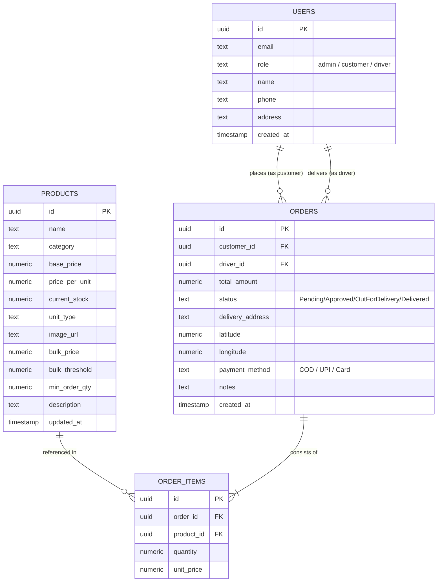
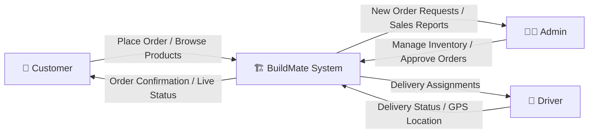

# THANGAM AGENCY — BUILDMATE
## Construction Material Management System
### Final Project Documentation

---

> **Submitted by:** THANGAM AGENCY
> **Application Name:** BuildMate
> **Platform:** Android & iOS (React Native / Expo)
> **Package ID:** com.antonyalwin7.BuildMate
> **Version:** 1.0.0
> **EAS Project ID:** 19cbcdc6-64d5-41bc-8f52-619978741916

---

## ABSTRACT

**BuildMate** is a comprehensive mobile application developed for **Thangam Agency**, a construction material supplier, to transform manual procurement and delivery operations into a seamless digital ecosystem. Built with **React Native (Expo SDK 54+)** for the frontend and **Supabase** (PostgreSQL / Auth / Storage) for the backend, BuildMate offers a robust, real-time platform catering to three distinct user roles: **Administrators**, **Customers**, and **Drivers**.

The system addresses critical industry pain points including inventory inaccuracies, lack of delivery transparency, and inefficient logistical coordination. By implementing a centralized cloud database with real-time synchronization, BuildMate ensures that stock levels are always accurate, orders are tracked from placement to delivery, and financial transactions are recorded securely. This documentation covers the complete project lifecycle — from system analysis and design to implementation and testing.

---

## TABLE OF CONTENTS

1. **Chapter I: Introduction**
   - 1.1 Problem Definition
   - 1.2 Project Objectives
   - 1.3 Scope of the Project
2. **Chapter II: System Analysis**
   - 2.1 Existing System
   - 2.2 Proposed System
3. **Chapter III: Development Environment**
   - 3.1 Hardware Requirements
   - 3.2 Software Requirements
   - 3.3 Software Description
4. **Chapter IV: System Design**
   - 4.1 Data Model
     - 4.1.1 Entity Relationship Diagram
     - 4.1.2 Data Dictionary
     - 4.1.3 Table Relationship
   - 4.2 Process Model
     - 4.2.1 Context Analysis Diagram
     - 4.2.2 Data Flow Diagram
5. **Chapter V: Software Development**
   - 5.1 Project File Structure
   - 5.2 Modular Description
   - 5.3 Key Logic Implementation
6. **Chapter VI: Testing**
   - 6.1 System Testing
   - 6.2 Test Data and Output
     - 6.2.1 Unit Testing
     - 6.2.2 Integration Testing
   - 6.3 Testing Techniques and Strategies
   - 6.4 Validation Testing
   - 6.5 User Acceptance Testing
7. **Chapter VII: System Implementation**
   - 7.1 Introduction
   - 7.2 Implementation Steps
8. **Chapter VIII: Performance and Limitations**
   - 8.1 Merits of the System
   - 8.2 Limitations of the System
   - 8.3 Future Enhancements
9. **Chapter IX: Appendices**
   - 9.1 Sample Screens and Reports
   - 9.2 User Manual
   - 9.3 Conclusion
10. **Chapter X: References**

---

## CHAPTER I: INTRODUCTION

### 1.1 Problem Definition

**Thangam Agency** is a construction material supplier that has historically operated using traditional, manual workflows. The day-to-day operations — from receiving customer orders to dispatching delivery drivers — relied on phone calls, handwritten ledgers, and verbal communication. This approach introduces several compounding problems:

- **Inventory Errors**: Stock levels updated manually at end-of-day lead to overselling and customer disappointment.
- **No Order Visibility**: Customers have no way to track their order once placed. They must repeatedly call to check status.
- **Logistics Inefficiency**: Dispatch staff coordinate drivers manually without any GPS-assisted routing.
- **Revenue Leakage**: Bulk discount thresholds are applied inconsistently without a system to enforce them automatically.
- **Poor Data Storage**: Invoices and order histories are stored on paper, making audits and retrospective analysis impossible.

**BuildMate** is designed to solve these issues by providing a **unified digital platform** where inventory is managed in real-time, order tracking is automated, and delivery logistics are handled through a dedicated driver interface.

### 1.2 Project Objectives

The primary objectives of the BuildMate system are:

- **Centralization**: To create a single source of truth for all construction material data (products, orders, and users), accessible to all stakeholders simultaneously.
- **Transparency**: To provide customers with real-time tracking of their orders from placement through delivery, with clear status updates.
- **Efficiency**: To reduce the time between order placement and delivery assignment through automated workflows.
- **Scalability**: To build a modular system using Expo Router and Supabase that can easily expand into new material categories and geographic regions.
- **Data Integrity**: To ensure stock levels are updated via atomic PostgreSQL transactions — never manually guessed.
- **Financial Accuracy**: To auto-calculate bulk discounts, taxes, and grand totals, generating digital receipts that serve as invoices.

### 1.3 Scope of the Project

The scope of this project encompasses the development of a cross-platform mobile application and a cloud-based backend. Key boundaries include:

- **User Management**: Full registration and authentication for three distinct roles (Admin, Customer, Driver).
- **Inventory Control**: CRUD (Create, Read, Update, Delete) operations for construction materials, including image management via Supabase Storage.
- **Order Lifecycle**: Complete management of order states from "Pending" → "Approved" → "Out for Delivery" → "Delivered".
- **Logistics Engine**: GPS-based location capture and mapping services for delivery drivers using `expo-location` and `react-native-maps`.
- **Financial Tracking**: Generation of digital receipts and maintenance of order history.
- **Real-time Infrastructure**: Implementation of persistent WebSocket connections for instant data syncing across all user roles.

---

## CHAPTER II: SYSTEM ANALYSIS

### 2.1 Existing System

The traditional system of construction material management at Thangam Agency typically involves:

- **Manual Booking**: Orders are placed via phone calls or in-person visits to the warehouse.
- **Paper-Based Invoicing**: Receipts and delivery notes are handwritten or printed manually, making archival and retrieval difficult.
- **Fragmented Tracking**: Customers must call the supplier to check on delivery status, who in turn must call the driver.
- **Static Inventory**: Stock levels are updated at the end of the day or week, leading to "overselling" situations during peak demand hours.
- **Human Error Prone**: Incorrect quantities, wrong addresses, and miscalculated totals are common due to manual data entry.

**Drawbacks of the Existing System:**

| Drawback | Impact |
| :--- | :--- |
| No real-time stock visibility | Customers order unavailable materials |
| Manual driver dispatch | Delays in delivery; high coordination overhead |
| Paper-based records | Records get lost; no searchable history |
| No bulk discount automation | Pricing is inconsistent, leading to revenue loss |
| No customer self-service | High call volume burden on staff |

### 2.2 Proposed System

The proposed BuildMate system introduces a modernized, automated approach:

- **Real-time Availability**: The mobile app fetches live stock data directly from the Supabase PostgreSQL database, updated atomically on every order.
- **Role-Based Access Control (RBAC)**: Tailored dashboards for three distinct user roles — Admins (inventory and order management), Customers (shopping and tracking), and Drivers (delivery task management).
- **Automated Workflow**: When a customer places an order, stock is automatically decremented, and a "Pending" entry is created for the Admin to review, approve, and assign to a driver.
- **Location Intelligence**: Uses `expo-location` and `react-native-maps` to capture precise delivery coordinates at checkout and provide turn-by-turn navigation routes for drivers.
- **Cloud Synchronization**: All data is synchronized across devices instantly using Supabase Real-time subscriptions over WebSockets.
- **Digital Invoicing**: Auto-generated order summaries with itemized costs, applied discounts, and final totals act as digital receipts.

**Advantages of the Proposed System:**

| Advantage | Benefit |
| :--- | :--- |
| Real-time stock management | No more overselling; always-accurate inventory |
| Role-specific dashboards | Every user sees only what is relevant to their job |
| GPS-integrated delivery | Faster and more accurate deliveries |
| Automated bulk discounts | Consistent pricing; improved customer trust |
| Cloud-based data storage | Searchable history; no data loss |

---

## CHAPTER III: DEVELOPMENT ENVIRONMENT

### 3.1 Hardware Requirements

For the development and deployment of BuildMate, the following hardware specifications were utilized:

**A. Development Machine (Workstation):**

| Component | Specification |
| :--- | :--- |
| Processor | Intel Core i5/i7 (10th Gen or higher) |
| RAM | 16 GB DDR4 (8 GB minimum) |
| Storage | 256 GB SSD (512 GB recommended) |
| Display | Full HD (1920×1080) for interface design and debugging |
| OS | Windows 11 / macOS Sonoma / Linux (Ubuntu) |

**B. Target Mobile Devices:**

| Platform | Minimum Requirement |
| :--- | :--- |
| Android | Android 8.0 (Oreo) or higher, with GPS support |
| iOS | iPhone with iOS 13.0 or higher |
| Storage | Minimum 100 MB available device storage |

### 3.2 Software Requirements

The project relies on a modern software stack to ensure cross-platform compatibility and rapid development:

| Category | Tool / Technology |
| :--- | :--- |
| Operating System | Windows 11 / macOS Sonoma / Linux (Ubuntu) |
| IDE | Visual Studio Code (with React Native & TypeScript extensions) |
| Version Control | Git / GitHub |
| Mobile Framework | React Native 0.81.5 |
| App Platform | Expo SDK ~54.0.33 |
| Routing | Expo Router ^6.0.23 |
| Backend (BaaS) | Supabase (@supabase/supabase-js ^2.95.3) |
| State Management | Zustand ^5.0.11 |
| Styling | NativeWind ^2.0.11 + Tailwind CSS ^3.3.2 |
| Package Manager | npm |
| Build System | EAS Build (Expo Application Services) |
| Language | TypeScript ~5.9.2 |

### 3.3 Software Description

BuildMate is built upon a modern, cloud-native stack that ensures high performance and developer productivity:

**React Native & Expo SDK:**
React Native is the foundational framework that allows for the creation of truly native mobile applications using JavaScript and React. Unlike hybrid frameworks, React Native renders using real native UI components, ensuring a smooth 60fps experience. Expo simplifies the development lifecycle through **EAS Build** for cloud-based APK/IPA generation, **Expo Go** for sandboxed testing, and a unified hardware API for Camera, GPS, and Secure Storage.

**Supabase (The Backend):**
- **PostgreSQL Database**: Provides a reliable, relational storage engine with support for complex queries, foreign key constraints, and atomic transactions (critical for stock management).
- **GoTrue Auth**: Handles identity management with secure JWT-based login, signup, and session persistence. User roles (`admin`, `customer`, `driver`) are stored in profile metadata.
- **Real-time Engine**: Utilizes PostgreSQL's logical replication to broadcast database changes to clients over WebSockets — critical for live stock and active order features.
- **Storage Buckets**: Provides an S3-compatible interface for storing image assets such as product thumbnails and proof-of-delivery photos.

**Zustand (Global State Management):**
Zustand provides a clean, hook-based alternative to Redux with minimal boilerplate and high performance by preventing unnecessary re-renders. BuildMate uses it for the `authStore` (user session), `productStore` (product cache), `cartStore` (shopping cart), and `orderStore` (real-time subscriptions).

**NativeWind & Tailwind CSS:**
NativeWind brings Tailwind CSS to React Native, allowing a design-system-first approach to styling. All screens use utility classes, ensuring consistency across the Admin, Customer, and Driver interfaces.

**Expo Router:**
The file-based router for React Native, mirroring Next.js conventions. Navigation is defined by the folder structure (e.g., `app/(admin)/inventory.tsx`), which reduces routing bugs and makes role-based layout grouping highly intuitive.

---

## CHAPTER IV: SYSTEM DESIGN

### 4.1 Data Model

BuildMate uses a relational data model managed by Supabase PostgreSQL to ensure data integrity and complex relationship management.

#### 4.1.1 Entity Relationship Diagram (ERD)



#### 4.1.2 Data Dictionary

**Table: `users`**

| Column | Data Type | Constraint | Description |
| :--- | :--- | :--- | :--- |
| id | uuid | PK, Default: `auth.uid()` | Linked to Supabase Auth user ID |
| email | text | Unique, Not Null | Primary contact / Login identifier |
| role | text | Not Null, Default: `'customer'` | Access level: `admin`, `customer`, or `driver` |
| name | text | — | Full name for invoicing |
| phone | text | — | Mobile number for delivery contact |
| address | text | — | Default billing/shipping address |
| created_at | timestamp | Default: `now()` | Record creation timestamp |

**Table: `products`**

| Column | Data Type | Constraint | Description |
| :--- | :--- | :--- | :--- |
| id | uuid | PK, Default: `gen_random_uuid()` | Unique product identifier |
| name | text | Not Null | Trade name of the material (e.g., Ultratech Cement) |
| category | text | Not Null | Material group: Cement, Steel, Bricks, Sand |
| base_price | numeric | Not Null | Standard reference price |
| price_per_unit | numeric | Not Null | Current selling price |
| current_stock | numeric | Not Null | Available units in warehouse |
| unit_type | text | — | Metric unit: bags, tons, cft, numbers |
| image_url | text | — | URL to Supabase Storage product image |
| bulk_price | numeric | — | Discounted price for bulk orders |
| bulk_threshold | numeric | — | Minimum quantity to trigger bulk pricing |
| min_order_qty | numeric | — | Minimum allowed purchase quantity |
| description | text | — | Detailed product specifications |
| updated_at | timestamp | — | Timestamp of last inventory update |

**Table: `orders`**

| Column | Data Type | Constraint | Description |
| :--- | :--- | :--- | :--- |
| id | uuid | PK | Unique order tracking number |
| customer_id | uuid | FK (`users.id`) | Ordering customer reference |
| driver_id | uuid | FK (`users.id`) | Assigned delivery driver reference |
| total_amount | numeric | Not Null | Final transaction value |
| status | text | Not Null | Order lifecycle: Pending → Approved → OutForDelivery → Delivered |
| delivery_address | text | Not Null | Physical delivery location |
| latitude | numeric | Not Null | GPS latitude for precision navigation |
| longitude | numeric | Not Null | GPS longitude for precision navigation |
| payment_method | text | — | `COD`, `UPI`, or `Card` |
| notes | text | — | Special delivery instructions |
| created_at | timestamp | — | Time of order placement |

**Table: `order_items`**

| Column | Data Type | Constraint | Description |
| :--- | :--- | :--- | :--- |
| id | uuid | PK | Unique line item ID |
| order_id | uuid | FK (`orders.id`) | Parent order reference |
| product_id | uuid | FK (`products.id`) | Linked material reference |
| quantity | numeric | Not Null | Quantity purchased |
| unit_price | numeric | Not Null | Price at the exact time of purchase |

#### 4.1.3 Table Relationships

- **One-to-Many (Users → Orders)**: A single customer can place multiple orders over time.
- **One-to-Many (Drivers → Orders)**: A single driver can be assigned to multiple delivery tasks.
- **One-to-Many (Orders → OrderItems)**: Every order contains one or more line items (materials).
- **Many-to-One (OrderItems → Products)**: Many line items across different orders can reference the same product.

### 4.2 Process Model

#### 4.2.1 Context Analysis Diagram

The Context Diagram shows the system's external entities and high-level data flow:



#### 4.2.2 Data Flow Diagram (DFD)

**Level 0 — System Overview:**

The BuildMate system takes inputs from three user entities and produces appropriate outputs via the Supabase backend.

**Level 1 DFD — Key Processes:**

| Process | Input | Output |
| :--- | :--- | :--- |
| **1.0 Authentication** | User credentials (email, password) | Verified session + role-based redirect |
| **2.0 Inventory Management** | Product data, images from Admin | Updated product catalog; decremented stock on order |
| **3.0 Order Management** | Cart data + payment from Customer | Created order record, updated stock, driver queue entry |
| **4.0 Logistics & Delivery** | GPS coordinates, driver action | Updated order status; real-time push to customer |

---

## CHAPTER V: SOFTWARE DEVELOPMENT

### 5.1 Project File Structure

```
BuildMate/
├── app/                          # Expo Router — all screens
│   ├── _layout.tsx               # Root layout (auth session check)
│   ├── index.tsx                 # Entry point (role-based routing)
│   ├── (auth)/                   # Unauthenticated screens
│   │   ├── login.tsx
│   │   └── register.tsx
│   ├── (admin)/                  # Admin-only screens
│   │   ├── _layout.tsx
│   │   ├── dashboard.tsx         # Business metrics overview
│   │   ├── inventory.tsx         # Product CRUD + image upload
│   │   └── orders.tsx            # Order approval & driver assignment
│   ├── (customer)/               # Customer-only screens
│   │   ├── _layout.tsx
│   │   ├── home.tsx              # Product catalog & browsing
│   │   ├── stock.tsx             # Stock status overview
│   │   ├── cart.tsx              # Shopping cart management
│   │   ├── checkout.tsx          # Location capture + payment selection
│   │   ├── order-confirmation.tsx# Post-checkout receipt
│   │   └── orders.tsx            # Order history & live tracking
│   └── (driver)/                 # Driver-only screens
│       ├── _layout.tsx
│       └── dashboard.tsx         # Delivery task queue + navigation
├── services/                     # Supabase API call layer
│   ├── authService.ts            # Login, signup, session management
│   ├── productService.ts         # Product CRUD, image upload
│   └── orderService.ts           # Order creation, status updates
├── store/                        # Zustand global state stores
│   ├── authStore.ts              # Current user & role
│   ├── productStore.ts           # Product list cache
│   ├── cartStore.ts              # Cart items, totals, bulk discounts
│   └── orderStore.ts             # Active orders + real-time listener
├── context/
│   └── AuthContext.tsx           # Auth provider wrapping the app
├── lib/
│   └── supabase.ts               # Supabase client initialization
├── types/
│   └── index.ts                  # Shared TypeScript interfaces
├── utils/
│   └── (helpers)                 # Utility/helper functions
├── components/
│   └── (shared UI components)
├── assets/                       # Icons, splash screen, images
├── app.json                      # Expo configuration
├── package.json                  # Dependencies manifest
├── tailwind.config.js            # NativeWind/Tailwind theme config
├── tsconfig.json                 # TypeScript configuration
├── babel.config.js               # Babel configuration
├── eas.json                      # EAS Build profiles
└── .env                          # Supabase API keys (git-ignored)
```

### 5.2 Modular Description

BuildMate is architected into logically separated modules to ensure high maintainability and scalability. Each module manages a specific domain of the application.

**A. Authentication Module (`services/authService.ts`, `context/AuthContext.tsx`):**
- Manages user signup, login, and session persistence using Supabase GoTrue Auth (JWT-based).
- The `AuthContext` provides global access to the current `user` object and their specific `role`.
- On app launch, the root `_layout.tsx` checks for an existing Supabase session and routes users to their corresponding Expo Router group.

**B. Product & Inventory Module (`services/productService.ts`, `store/productStore.ts`):**
- Handles retrieval and management of all construction materials.
- **Admins** use this to add, edit, or delete products and manage image uploads to Supabase Storage buckets.
- **Customers** use this to browse materials by category (Cement, Steel, Bricks, Sand) and view real-time stock levels.
- The `productStore` (Zustand) caches the product list locally for instant UI responsiveness.

**C. Order Management Module (`services/orderService.ts`, `store/orderStore.ts`, `store/cartStore.ts`):**
- Manages the entire order lifecycle from "Pending" to "Delivered".
- The `cartStore` handles local shopping cart logic: item quantities, pricing calculations, and bulk discount application.
- The `orderService` performs transaction-safe operations: creating the `orders` record and all corresponding `order_items` records atomically.
- Real-time subscriptions in `orderStore` push status changes instantly to affected devices.

**D. Logistics & Delivery Module (`app/(driver)/dashboard.tsx`):**
- Specific to the Driver role. Fetches all orders assigned to the currently logged-in driver.
- Integrates with `expo-location` and `react-native-maps` to display customer GPS coordinates and enable navigation.
- Drivers can update delivery status directly from the dashboard.

### 5.3 Key Logic Implementation

**5.3.1 Atomic Stock Reduction**

To prevent race conditions where two customers might simultaneously purchase the last unit of a product, BuildMate uses PostgreSQL atomic operations. The `orderService` decrements stock only if `current_stock >= requested_quantity`, all within a single database transaction. If insufficient stock is detected, an error is returned to the UI and the order is rejected before creation.

**5.3.2 Role-Based Routing Logic**

The application entry point (`app/index.tsx`) implements a gatekeeper routing system:
1. Check for a persistent Supabase session on app start.
2. If no session exists → redirect to `(auth)/login` screen.
3. If a session exists → fetch the `role` from the user's profile in the `users` table.
4. Route the user to the corresponding Expo Router group: `(admin)`, `(customer)`, or `(driver)`.

**5.3.3 Real-time Order Subscriptions**

The `orderStore` initializes a Supabase real-time channel listener on the `orders` table. When an Admin changes an order's `status` from "Pending" to "Approved", Supabase broadcasts the row change over WebSockets. The relevant Customer's device receives this update, triggers a local Zustand state update, and re-renders the order status UI — without any manual refresh by the user.

**5.3.4 Bulk Pricing Logic**

The `cartStore` automatically applies bulk discounts when a customer's ordered quantity exceeds the product's `bulk_threshold`. The unit price switches from `price_per_unit` to `bulk_price` for all units in the order, and the cart total is recalculated live.

---

## CHAPTER VI: TESTING

### 6.1 System Testing

System testing was performed to verify that the integrated system meets all specified requirements through end-to-end workflow validation:

1. **Product Creation (Admin)**: Verified that new products created in the Admin inventory screen appear instantly on the Customer product catalog.
2. **Order Placement (Customer)**: Confirmed that stock levels decrement correctly and atomically upon successful order confirmation.
3. **Order Processing (Admin)**: Verified that the Admin can approve pending orders, assign available drivers, and that the status change propagates in real time.
4. **Delivery Completion (Driver)**: Ensured that marking an order as "Delivered" updates the Customer's order history and closes the driver's delivery queue entry.

### 6.2 Test Data and Output

#### 6.2.1 Unit Testing

Individual logic blocks were tested to ensure they produce expected outputs for given inputs.

**Table: Unit Test Cases**

| Test ID | Module | Input Scenario | Expected Output | Status |
| :--- | :--- | :--- | :--- | :--- |
| UT-01 | Cart Logic | Add 2 bags of Cement @ ₹350 per bag | Cart Total = ₹700 | ✅ Pass |
| UT-02 | Bulk Pricing | Order 101 units of Brick (Bulk Threshold: 100) | Apply Bulk Price; total recalculated | ✅ Pass |
| UT-03 | Stock Guard | Order 50 tons of Sand (Stock: 40 tons) | Return "Insufficient Stock" error; block order | ✅ Pass |
| UT-04 | Auth Validation | Enter password < 6 characters at registration | Display "Weak Password" UI alert | ✅ Pass |
| UT-05 | GPS Capture | Tap "Use My Location" at checkout | GPS coordinates (lat/lng) captured and saved | ✅ Pass |
| UT-06 | Role Routing | Login as user with `role = 'driver'` | Redirected to `(driver)/dashboard` screen | ✅ Pass |

#### 6.2.2 Integration Testing

Testing the integration between the React Native frontend and the Supabase backend.

**Table: Integration Test Cases**

| Test ID | Integration Point | Action | Observed Result | Status |
| :--- | :--- | :--- | :--- | :--- |
| IT-01 | Supabase Auth | New user signup | Row created in Supabase Auth + `public.users` table | ✅ Pass |
| IT-02 | Real-time Products | Admin updates stock quantity | Customer UI product list refreshes in < 500ms | ✅ Pass |
| IT-03 | Image Upload | Admin uploads product image | Public URL generated, image visible in product card | ✅ Pass |
| IT-04 | Order Transaction | Customer confirms order | Record created in `orders`; child records in `order_items`; stock decremented | ✅ Pass |
| IT-05 | Real-time Status | Admin approves order | Customer device receives live status update via Supabase channel | ✅ Pass |
| IT-06 | Driver Assignment | Admin assigns driver to order | Order appears in Driver's delivery dashboard immediately | ✅ Pass |

### 6.3 Testing Techniques and Strategies

- **Black-Box Testing**: Performed to test the functionality of the system without looking at the internal code structure. This focused on UI/UX interactions — verifying button actions, form validations, and navigation flows.
- **White-Box Testing**: Used to test the internal logic, specifically the service layer (`authService.ts`, `orderService.ts`, `productService.ts`) and database schema constraints.
- **Boundary Value Analysis**: Testing the system at the edges — minimum permitted order quantity (`min_order_qty`) and quantity exceeding available stock — to validate guard conditions.
- **Regression Testing**: After fixing bugs, all previously passing test cases were re-run to ensure no new defects were introduced.

### 6.4 Validation Testing

Validation testing ensures that the software meets user needs through scenario-based testing:

- **Scenario 1 (Stock Validation)**: A customer attempts to add 10 tons of sand to cart with only 5 tons in stock. **Result**: System blocks the "Add to Cart" action and displays a stock-limit error message.
- **Scenario 2 (Authentication)**: A user attempts to log in with an incorrect password. **Result**: Supabase Auth returns a 401 error; the app displays "Invalid credentials" without crashing.
- **Scenario 3 (Checkout Validation)**: Customer proceeds to checkout without capturing their GPS location. **Result**: The confirm order button remains disabled until a delivery address and coordinates are provided.

### 6.5 User Acceptance Testing (UAT)

Conducted with target stakeholders — actual contractors (as customers) and delivery drivers — to gather real-world feedback on usability. Key findings:

| Stakeholder | Feedback | Resolution |
| :--- | :--- | :--- |
| Delivery Driver | Buttons too small for use while wearing gloves | Increased touch target sizes on Driver Dashboard |
| Customer (Contractor) | Needed unit labels on product cards | Added `unit_type` (bags, tons, cft) labels to product cards |
| Admin (Thangam Agency) | Required summary totals on Dashboard | Added revenue and order count metrics to Admin Dashboard |

---

## CHAPTER VII: SYSTEM IMPLEMENTATION

### 7.1 Introduction

The implementation phase of BuildMate involved transitioning the conceptual design and tested code into a functional, production-ready mobile application. This phase ensures that the hosting environment (Supabase), the mobile build system (EAS), and the client-side application are all correctly synchronized and deployed.

### 7.2 Implementation Steps

The following steps were executed to implement the system:

1. **Database Provisioning (Supabase)**:
   - Created a new Supabase project for Thangam Agency.
   - Defined and deployed the PostgreSQL schema with tables: `users`, `products`, `orders`, and `order_items`.
   - Configured Row Level Security (RLS) policies to enforce role-based data access at the database level.

2. **Authentication Configuration**:
   - Enabled Email/Password authentication provider in the Supabase Auth dashboard.
   - Configured the `users` table to auto-populate on new sign-up via a PostgreSQL trigger.

3. **Storage Setup (Supabase Storage)**:
   - Created a public Storage bucket for product images.
   - Configured access policies to allow Admin uploads and public reads.

4. **Client-Side Setup (React Native / Expo)**:
   - Initialized the Expo project with `npx create-expo-app`.
   - Installed all core dependencies: `@supabase/supabase-js`, `zustand`, `nativewind`, `expo-router`, `expo-location`, `react-native-maps`.
   - Configured the Supabase client in `lib/supabase.ts` using `expo-secure-store` for token persistence.

5. **Environment Variable Management**:
   - Stored the Supabase Project URL and Anon Key in the `.env` file.
   - Added `.env` to `.gitignore` to prevent accidental credential exposure.

6. **Build and Distribution (EAS)**:
   - Configured `eas.json` with development, preview, and production build profiles.
   - Generated the Android `.apk` using `eas build --platform android --profile preview`.
   - Distributed the build internally to the Thangam Agency team for testing via EAS for internal testing.

---

## CHAPTER VIII: PERFORMANCE AND LIMITATIONS

### 8.1 Merits of the System

- **Operational Speed**: Real-time database subscriptions eliminate manual refreshes. Admins and drivers react instantly to new orders — typically within 300–500ms of the event occurring.
- **Data Accuracy**: Atomic PostgreSQL transactions ensure stock levels always reflect true availability, preventing the overselling problem that plagued the existing manual system.
- **Role Isolation**: Each user role (Admin, Customer, Driver) sees only the data and actions relevant to them, reducing cognitive load and minimizing the risk of accidental data modification.
- **Seamless User Experience**: The NativeWind-powered UI provides a polished, app-store-quality experience that sets a new standard for construction industry mobile software.
- **Cross-Platform Coverage**: A single React Native codebase runs natively on both Android and iOS, reducing long-term maintenance costs.

### 8.2 Limitations of the System

- **Internet Dependency**: Being a cloud-first application, BuildMate requires an active data connection. While `zustand` caches product data locally for browsing, order placement requires live connectivity to Supabase.
- **Backend Tier Constraints**: The current Supabase free-tier plan has limits on concurrent real-time WebSocket connections and monthly computation bandwidth, which may be felt during peak usage.
- **No Offline Order Queuing**: Orders cannot be queued offline and submitted when connectivity is restored — a feature that would benefit drivers in areas with poor signal.
- **Single Warehouse Scope**: The current data model is designed for a single warehouse (Thangam Agency). Multi-warehouse inventory routing is not yet supported.

### 8.3 Future Enhancements

- **AI Inventory Forecasting**: Integration of machine learning models to predict material demand based on seasonal construction trends and historical order data.
- **Advanced Analytics Dashboard**: Charts (via `victory-native`) to give Admins a visual representation of revenue growth, top-selling products, and order volume trends.
- **PWA / Web Admin Portal**: A full web version of the Admin module to allow inventory and order management from desktop computers.
- **Push Notifications**: Integration of Expo Push Notifications for instant alerts when order status changes, removing the need for real-time polling.
- **Multi-Warehouse Support**: Expanding the data model to support multiple warehouse locations, enabling regional stock management.
- **Driver Performance Tracking**: Analytics on driver delivery times and customer ratings to optimize logistics coordination.

---

## CHAPTER IX: APPENDICES

### 9.1 Sample Screens and Reports

- **Figure 1 — Splash & Authentication Screen**:
  The gateway to the application features a construction-themed splash screen with the Thangam Agency branding (background color: `#0a2a5c`). The login form uses secure input fields for email and password with clear error handling for invalid credentials. New users can register and are automatically assigned the `customer` role.

- **Figure 2 — Customer Product Catalog (`app/(customer)/home.tsx`)**:
  A high-performance product listing using React Native `FlatList` to smoothly render the full catalog. Each card displays the product image (from Supabase Storage), its name, real-time price per unit (with unit type), and a color-coded "In Stock" / "Low Stock" badge.

- **Figure 3 — Admin Inventory Management (`app/(admin)/inventory.tsx`)**:
  A specialized warehouse management interface with a search bar for quick filtering and full CRUD forms for editing product metadata. The image picker (`expo-image-picker`) allows admins to capture photos and upload them directly to Supabase Storage.

- **Figure 4 — Admin Orders Screen (`app/(admin)/orders.tsx`)**:
  A real-time list of incoming orders with full item breakdowns, customer details, and delivery addresses plotted on a map. The Admin can approve orders and assign available drivers from a dropdown list.

- **Figure 5 — Driver Task Dashboard (`app/(driver)/dashboard.tsx`)**:
  A focus-oriented UI listing active delivery assignments by status. Tapping an assignment opens a delivery mode with `react-native-maps` displaying the route from driver location to the customer's GPS coordinates. Status update buttons ("Out for Delivery", "Delivered") are prominently sized for one-thumb, on-the-go use.

- **Figure 6 — Customer Cart & Checkout (`app/(customer)/cart.tsx`, `checkout.tsx`)**:
  The cart displays an itemized list of materials with auto-calculated bulk discounts. The checkout screen uses `expo-location` to detect and confirm the delivery address, shows a map preview, and offers COD, UPI, and Card payment options.

- **Figure 7 — Order Confirmation & History (`app/(customer)/order-confirmation.tsx`, `orders.tsx`)**:
  The confirmation screen serves as a digital invoice showing all line items, applied discounts, and the final total. The orders list shows live status updates for each order in the customer's history.

### 9.2 User Manual

This manual provides step-by-step instructions for each user role.

**A. Administrator Manual**

1. **Login**: Open the BuildMate app and log in with your Admin credentials. You will be automatically directed to the Admin Dashboard.
2. **Dashboard**: The Dashboard displays key business metrics — total pending orders, today's revenue, and active drivers.
3. **Inventory Management** (`Inventory` tab):
   - **Add Product**: Tap the **"+"** button, fill in the product name, category, price, stock quantity, unit type, and upload an image.
   - **Edit Product**: Tap on any existing product card; update fields and tap **"Save"**.
   - **Delete Product**: Long-press a product card and confirm deletion.
4. **Order Processing** (`Orders` tab):
   - Monitor the list for new **"Pending"** orders.
   - Tap an order to see full item details, customer info, and the delivery location on a map.
   - Tap **"Approve"**, then select an available Driver from the dropdown and confirm assignment.
   - Orders move to **"Out for Delivery"** once the driver accepts.

**B. Customer Manual**

1. **Registration / Login**: Register using your email and password. You will be routed to the Customer home screen upon successful login.
2. **Browsing Products** (`Home` tab):
   - Scroll through the product catalog or use category filters (Cement, Steel, Bricks, Sand) to find materials.
   - Tap any product card to view its full description, bulk discount information, and stock availability.
3. **Cart & Checkout**:
   - Enter your desired quantity and tap **"Add to Cart"**. Bulk discounts apply automatically if thresholds are met.
   - Tap the **Cart** icon to review all added items and the total amount.
   - Tap **"Proceed to Checkout"** to confirm your delivery location on the map and select a payment method (COD, UPI, Card).
   - Tap **"Place Order"** to confirm. You will receive a digital confirmation receipt.
4. **Order Tracking** (`My Orders` tab):
   - View a history of all orders and see real-time status: Pending → Approved → Out for Delivery → Delivered.

**C. Driver Manual**

1. **Login**: Log in with your Driver credentials. You will be automatically routed to the Driver Dashboard.
2. **Delivery Queue** (`Deliveries` tab):
   - View all orders assigned to you, sorted by status.
   - Tap any delivery to see the full item manifest and the customer's delivery location on the map.
3. **Executing a Delivery**:
   - Tap **"Navigate"** to open map navigation to the customer's GPS coordinates.
   - Update status to **"Out for Delivery"** when you depart with the materials.
   - Upon handover, tap **"Mark as Delivered"** to complete the job and notify the customer.

### 9.3 Conclusion

BuildMate successfully digitizes the complex supply chain of construction materials for Thangam Agency. By providing a unified mobile platform for all stakeholders — Administrators, Customers, and Drivers — it eliminates miscommunication, ensures real-time inventory accuracy, and delivers a professional, modern service experience to contractors and builders.

The project achieves its goal of modernizing construction logistics through cutting-edge mobile technologies: React Native for cross-platform native performance, Supabase for scalable cloud infrastructure, and Zustand for responsive state management. BuildMate sets a new benchmark for how traditional construction suppliers can leverage technology to compete in a digital-first market.

---

## CHAPTER X: REFERENCES

1. **React Native Documentation** — Official guides for component development and native APIs. [reactnative.dev](https://reactnative.dev)
2. **Expo Documentation** — Cross-platform API references and EAS Build guides. [docs.expo.dev](https://docs.expo.dev)
3. **Supabase Guides** — PostgreSQL management, Auth, Storage, and Real-time integration. [supabase.com/docs](https://supabase.com/docs)
4. **Expo Router Documentation** — File-based routing for React Native. [docs.expo.dev/router](https://docs.expo.dev/router/introduction/)
5. **Zustand GitHub Repository** — Documentation on lightweight state management patterns. [github.com/pmndrs/zustand](https://github.com/pmndrs/zustand)
6. **NativeWind Documentation** — Tailwind CSS utility classes for React Native. [nativewind.dev](https://www.nativewind.dev/)
7. **"Software Engineering: A Practitioner's Approach"** — Roger S. Pressman (8th Edition).
8. **"Designing Data-Intensive Applications"** — Martin Kleppmann (2017) — Referenced for relational database design principles.
9. **React Native Maps** — Maps and geolocation integration. [github.com/react-native-maps/react-native-maps](https://github.com/react-native-maps/react-native-maps)
10. **Expo Location API** — GPS and location services. [docs.expo.dev/versions/latest/sdk/location/](https://docs.expo.dev/versions/latest/sdk/location/)
