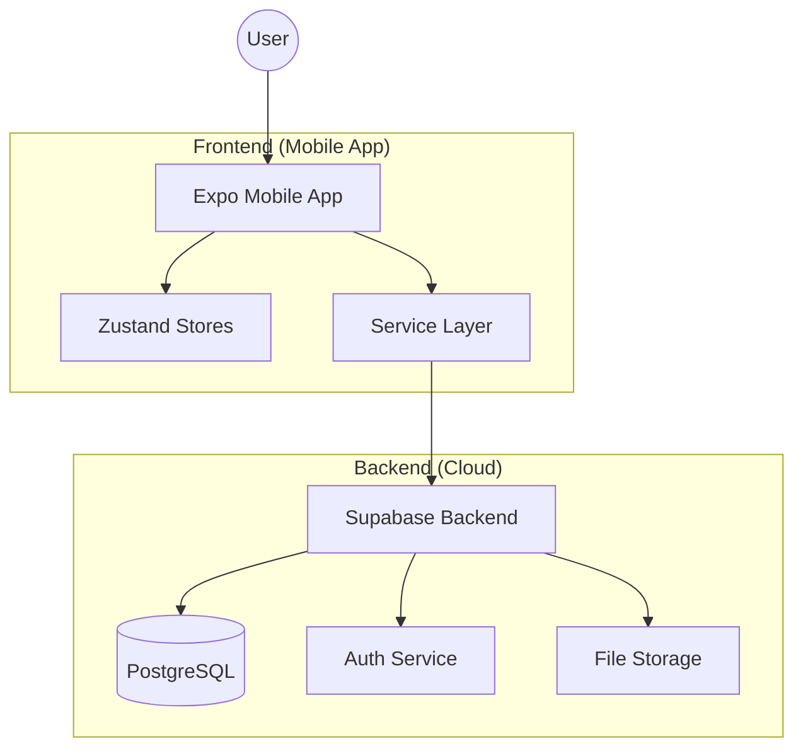

# BuildMate - Construction Material Management System
## Project Documentation - Part 1

### 1. Introduction

#### 1.1 Project Overview
BuildMate is a comprehensive mobile application designed to streamline the procurement and delivery of construction materials. In the rapidly evolving construction industry, efficient supply chain management is crucial for meeting project deadlines and maintaining budgets. BuildMate addresses these needs by providing a robust digital platform that connects customers, drivers, and material suppliers (administrators) in a unified ecosystem.

The application leverages modern mobile technologies to offer real-time tracking, inventory management, and secure transaction handling. By digitizing the manual processes involved in ordering construction supplies, BuildMate enhances transparency, reduces operational delays, and provides stakeholders with actionable insights into their material requirements.

#### 1.2 Problem Statement
Traditional methods of construction material procurement often suffer from several inefficiencies:
*   **Lack of Transparency:** Customers often lack visibility into real-time stock levels and pricing.
*   **Manual Order Tracking:** Tracking the status of deliveries is typically done through phone calls, leading to communication gaps.
*   **Inventory Inaccuracies:** Suppliers struggle to maintain accurate stock records, leading to overselling or stockouts.
*   **Complex Logistics:** Coordinating between drivers and delivery locations without a centralized system is error-prone.

#### 1.3 Objectives
The primary objectives of the BuildMate project are:
*   To develop a cross-platform mobile application for seamless material ordering.
*   To implement a real-time inventory management system for administrators.
*   To provide drivers with a dedicated interface for managing deliveries and navigation.
*   To ensure secure and reliable data storage using a cloud-based backend.
*   To enhance user experience through a modern, intuitive interface.

---

### 2. System requirements

#### 2.1 Functional Requirements
The system is divided into three primary modules based on user roles:

**A. Customer Module:**
*   **Product Catalog:** Ability to browse and search for construction materials by category.
*   **Cart Management:** Adding/removing items and managing quantities.
*   **Order Placement:** Securely placing orders with delivery location details.
*   **Order History:** Viewing past orders and their current status.
*   **Stock Monitoring:** Real-time visibility of available stock.

**B. Admin Module:**
*   **Inventory Management:** Full CRUD operations on products.
*   **Order Supervision:** Viewing all system orders and updating their statuses.
*   **Driver Assignment:** Assigning specific orders to available drivers.
*   **Real-time Analytics:** Dashboard overview of sales and inventory.

**C. Driver Module:**
*   **Delivery Management:** Viewing assigned orders and delivery locations.
*   **Status Updates:** Marking orders as "Out for Delivery" or "Delivered".
*   **Proof of Delivery:** (Future scope) Capturing delivery confirmation.

#### 2.2 Non-Functional Requirements
*   **Reliability:** The system must ensure data consistency between Supabase and the mobile app.
*   **Performance:** UI interactions and data fetching should be optimized for a smooth mobile experience.
*   **Security:** Role-based access control (RBAC) to ensure users only access authorized features.
*   **Scalability:** The architecture should support growing numbers of users and products.

#### 2.3 Hardware and Software Specifications
*   **Development Framework:** React Native with Expo.
*   **State Management:** Zustand.
*   **Backend:** Supabase (Postgres Database, Auth, Storage).
*   **Styling:** NativeWind (Tailwind CSS for React Native).
*   **Navigation:** Expo Router.

---

### 3. System Design and Architecture

#### 3.1 Architectural Overview
BuildMate follows a modern, decoupled architecture. The frontend is built using React Native (via Expo), ensuring a high-performance native feel on both iOS and Android. The backend logic and data storage are handled by Supabase, which provides a serverless infrastructure.

#### 3.2 Database Schema
The system uses a relational schema in PostgreSQL. Core tables include:
*   **users:** Stores user profiles, roles (admin, customer, driver), and contact info.
*   **products:** Contains material details, pricing, and stock levels.
*   **orders:** Tracks order metadata, statuses, and delivery locations.
*   **order_items:** Junction table linking orders to products with quantities.

#### 3.3 State Management
Zustand is used for lightweight and efficient state management. Individual stores are created for specific domains:
*   `authStore`: Manages user sessions and authentication state.
*   `productStore`: Handles local caching of the material catalog.
*   `orderStore`: Tracks order lists and updates.
*   `cartStore`: Manages the local shopping cart state.
